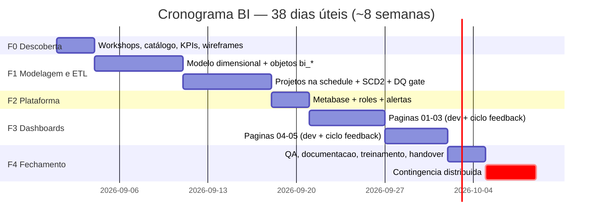

# ELT Lab — Visão de Business Intelligence e Plano de Trabalho

**Documento:** Proposta de Visão Analítica (BI), Protótipo e Estimativas
**Plataforma base:** ELT Lab (Airflow + PostgreSQL medalhão + MinIO + JupyterLab)
**Alocação:** 1 Analista de Dados Sênior — dedicação integral (8h/dia)
**Versão:** 1.0 — proposta para aprovação

---

## 1. Sumário Executivo

O ELT Lab já possui a fundação necessária para operar como plataforma de BI: camadas medalhão
(bronze/silver/gold), log auditável de execuções (`global.controle_execucao`), orquestração com
cron por projeto e conectores para as fontes típicas (Google Sheets, XLSX, Oracle, PostgreSQL,
S3/CKAN, API REST, FTP/DATASUS, MinIO).

Esta proposta define:

1. **Cinco visões analíticas** (páginas de dashboard) com KPIs, fontes e wireframes;
2. **Cronograma-base de ETL** (janelas, dependências e SLAs);
3. **Protótipo navegacional** das páginas;
4. **Plano de trabalho e estimativas** para entrega com 1 analista sênior dedicado.

**Resumo da estimativa:** 38 dias úteis (≈ 8 semanas), 304 horas, incluindo contingência de ~10%.

---

## 2. Ativos de Dados Disponíveis (ponto de partida)

| Ativo | Onde está | Potencial analítico |
|-------|-----------|---------------------|
| Cadastro de municípios (IBGE): código, UF, lat/long, DDD, fuso | Projeto `municipios_ibge` (bronze→silver→gold, `dm_municipios_por_uf`) | Análise territorial, mapas, enriquecimento de qualquer base com geografia |
| Log de execuções: processo, projeto, status, início/fim, registros inseridos, erros | `elt.global.controle_execucao` | **BI do próprio pipeline**: SLA, duração, volume por carga, taxa de erro |
| Tabela de parametrização: fontes ativas, crons, estratégias | `elt.global.schedule` | Catálogo vivo de fontes e cobertura de cargas |
| Qualquer fonte nova | Conectores prontos (Sheets/XLSX/Oracle/PG/API/S3/FTP) | Onboarding rápido de domínios de negócio (ex.: planilhas gerenciais, bases DATASUS via FTP, sistemas internos Oracle) |

> A página de domínio (Seção 4.5) é um template replicável: cada nova fonte entra pela tabela
> `schedule` sem código novo de pipeline.

## 3. Personas e Perguntas de Negócio

| Persona | Perguntas que o BI responde |
|---------|----------------------------|
| **Gestor/Diretoria** | "Os dados estão atualizados? O que mudou desde ontem? Onde estão os outliers?" |
| **Coordenação de dados** | "As cargas rodaram? O que falhou na madrugada? Qual tabela está atrasada?" |
| **Analista de negócio** | "Como o indicador se comporta por região/período? Posso confiar na qualidade?" |
| **Time técnico** | "Qual step demora mais? Volume cresceu quanto? Onde otimizar primeiro?" |

---

## 4. Visões Analíticas (Páginas)

### 4.1 Página 01 — Visão Executiva

**Objetivo:** resposta em 10 segundos sobre a saúde dos dados e os principais indicadores.
**Persona:** gestoria. **Refresh:** a cada carga gold (D+1 07:30).

| Visual | Tipo | Fonte |
|--------|------|-------|
| Última atualização por domínio | Cards com semáforo (verde ≤ 24h / amarelo ≤ 48h / vermelho > 48h) | `dm_freshness` |
| Registros processados nas últimas 24h/7d/30d | Big numbers com variação % | `dm_execucao_diaria` |
| Taxa de sucesso das cargas (30d) | Gauge + sparkline | `dm_execucao_diaria` |
| Top 3 anomalias do dia | Lista (erro mais recente por projeto) | `dm_execucao_erros` |

```
┌──────────────────────────────────────────────────────────────────┐
│ VISÃO EXECUTIVA                          [Projeto ▾] [Período ▾] │
├────────────┬────────────┬────────────┬───────────────────────────┤
│ ● Fonte A  │ ● Fonte B  │ ○ Fonte C  │  Sucesso cargas (30d)     │
│   07:31    │   07:29    │  52h atras │  ████████████░░ 96,4%     │
├────────────┴────────────┴────────────┼───────────────────────────┤
│ Registros processados                │ Variação semanal          │
│ 24h: 128.430   7d: 902.117           │  ▁▃▂▅▄▆▇  +12,3%         │
├──────────────────────────────────────┴───────────────────────────┤
│ ATENÇÃO: Fonte C sem carga há 52h — ver Pipeline                 │
└──────────────────────────────────────────────────────────────────┘
```

### 4.2 Página 02 — Monitoramento do Pipeline

**Objetivo:** radiografia operacional do ELT (é um diferencial do Lab: o pipeline audita a si mesmo).
**Persona:** coordenação de dados/time técnico. **Refresh:** 15 min.

| Visual | Tipo | Fonte |
|--------|------|-------|
| Timeline das execuções (Gantt simplificado) por janela noturna | Timeline | `controle_execucao` |
| Duração média × última execução, por step | Barras comparativas + desvio | `dm_step_duracao` |
| Taxa de erro por projeto/fonte (30d) | Heatmap semana × dia | `dm_execucao_diaria` |
| Volume de registros por carga (tendência) | Linha com média móvel 7d | `dm_volume_carga` |
| Tabela de falhas recentes com botão "abrir log no Airflow" | Tabela detalhada | `controle_execucao` |

```
┌──────────────────────────────────────────────────────────────────┐
│ MONITORAMENTO DO PIPELINE              [Data: ontem ▾] [Camada▾] │
├──────────────────────────────────────────────────────────────────┤
│ 04:00      05:00      06:00      07:00      08:00                │
│ ████bronze ██silver ███gold            ── janela padrão          │
├──────────────────────────────────────────────────────────────────┤
│ Duração por step (média 30d × hoje)                              │
│ bronze.ibge     ▓▓▓▓▓▓ 6m12s  → hoje 9m40s (+55%) ⚠             │
│ silver.ibge     ▓▓▓    2m05s  → hoje 1m58s (-6%) ✓              │
│ gold.ibge       ▓      0m48s  → hoje 0m51s (+6%) ✓              │
├──────────────────────────────────────────────────────────────────┤
│ Falhas recentes                                                  │
│ 21/08 05:12  FTP_DATASUS  timeout após 3 retries  [log ↗]        │
└──────────────────────────────────────────────────────────────────┘
```

### 4.3 Página 03 — Análise Territorial

**Objetivo:** explorar indicadores por recorte geográfico (padrão replicável para qualquer base
com chave de município/UF).
**Persona:** analista de negócio. **Refresh:** D+1.

| Visual | Tipo | Fonte |
|--------|------|-------|
| Mapa coroplético por UF | Mapa (choropleth) | `ft_indicador_uf` + lat/long do cadastro IBGE |
| Ranking UFs por indicador | Barras horizontais com destaque top/bottom | `dm_municipios_por_uf` |
| Drill-through UF → lista de municípios | Tabela drill | silver `tb_municipios_nf` |
| Comparador de períodos | Seletor com delta % embutido | fatos por período |

```
┌──────────────────────────────────────────────────────────────────┐
│ ANÁLISE TERRITORIAL        [Indicador ▾] [UF ▾] [Comparar: ▾]    │
├───────────────────────────────┬──────────────────────────────────┤
│                               │ RANKING UF                       │
│        [ M A P A ]            │ 1 BA ████████████ 417            │
│   choropleth por indicador    │ 2 PE ██████████ 185              │
│                               │ ...                              │
│                               │ 9 SE ███ 75                      │
├───────────────────────────────┴──────────────────────────────────┤
│ Drill: clique na UF → municípios com valores e participação %    │
└──────────────────────────────────────────────────────────────────┘
```

### 4.4 Página 04 — Qualidade de Dados

**Objetivo:** confiança mensurável — completude, unicidade, volumes anômalos.
**Persona:** gestão + analistas. **Refresh:** a cada gate silver→gold.

| Visual | Tipo | Fonte |
|--------|------|-------|
| Score de qualidade por domínio (0–100) | Bullet chart | `dm_qualidade_score` |
| Regras reprovadas na última janela | Tabela com severidade | `dq_resultados` |
| Completude por coluna crítica (%) | Barras empilhadas | `dq_colunas` |
| Volumes fora do esperado (±3σ vs média móvel) | Scatter com bandas | `dm_volume_carga` |
| Linhas em quarentena | Counter + link para tabela quarantine | `silver_quarantine.*` |

### 4.5 Página 05 — Domínio de Negócio (Template Replicável)

**Objetivo:** página padrão para cada novo domínio onboardado (ex.: produção ambulatorial
DATASUS, planilhas gerenciais em Sheets, sistemas internos Oracle).

Estrutura fixa em 4 blocos (o que muda é só a fonte):
1. **Header:** filtros globais (período, unidade/região, categoria);
2. **KPIs:** 4–6 indicadores-chave do domínio com comparação período anterior;
3. **Tendência:** série temporal do indicador principal com média móvel;
4. **Detalhe:** tabela drill-down exportável (CSV/XLSX) com os registros que compõem o número.

> Cada novo domínio = novos INSERTs em `elt.global.schedule` (bronze/silver/gold) + clone da página.
> Sem deploy de código de pipeline — apenas parametrização.

---

## 5. Cronograma-Base de ETL (Janelas e SLAs)

### 5.1 Janela diária padrão (segunda a sábado)

| Ordem | Janela | Cron | Camada | Conteúdo | SLA de conclusão |
|-------|--------|------|--------|----------|------------------|
| 1 | 05:00 | `0 5 * * 2-6` | Bronze | Cargas incrementais das fontes externas (Sheets, APIs, FTP, S3) | 06:00 |
| 2 | 06:00 | `0 6 * * 2-6` | Silver | Padronização, deduplicação, regras de qualidade (gate) | 07:00 |
| 3 | 07:00 | `0 7 * * 2-6` | Gold | Dimensões/fatos + SCD2 + agregados de dashboard | 07:45 |
| 4 | 07:30 | `30 7 * * 2-6` | BI | Refresh de cache/alertas de freshness (após gold) | 08:00 |

Dependências encadeadas (`depends_on` entre tasks ou sensor de tabela pronta):

```
fontes externas ──► bronze (05:00) ──► silver+DQ (06:00) ──► gold (07:00) ──► dashboards (07:30)
                                        │
                                        └─ reprovação ──► quarantine + alerta (não bloqueia gold parcial)
```

### 5.2 Janelas complementares

| Recorrência | Cron | Conteúdo |
|-------------|------|----------|
| Full semanal (referência/reparo) | `0 4 * * 1` | Reload full das fontes incrementais + validações cruzadas (padrão já usado pelo projeto `municipios_ibge`) |
| Fechamento mensal | `0 9 1 * *` | Consolidação de fatos mensais, snapshot de scores de qualidade |
| Manutenção | `0 3 15 * *` | Retenção de `controle_execucao`, vacuum, limpeza de partições antigas |

> Janelas escalonadas evitam contenção (ver doc de melhorias técnicas, Seção 8.3) e dão SLA
> verificável ao negócio: "dado pronto até 08:00".

---

## 6. Protótipo — Navegação e Padrão Visual

### 6.1 Mapa de navegação

```
┌ Início (Executiva) ──┬── Pipeline ────┬── Território ──┬── Qualidade ──┬── [Domínio X] ┐
│                      │  (02)          │  (03)          │  (04)         │  (05...)      │
└── breadcrumb global + seletor de período persistente em todas as páginas ────────────────┘
```

### 6.2 Padrão visual sugerido

| Elemento | Padrão |
|----------|--------|
| Layout | Grade 12 colunas; header com filtros globais; máx. 6 visuais por tela |
| Cores | 1 cor primária institucional + semáforo verde/amarelo/vermelho apenas para status (nunca decoração) |
| Números | Big number sempre com contexto: valor + variação % + referência ("vs semana anterior") |
| Tabelas | Máx. 10 linhas visíveis + export CSV/XLSX |
| Performance | Dashboards respondem < 3s: agregados pré-calculados no gold, nunca consulta direta em bronze/silver |
| Mobile | Página Executiva responsiva; demais priorizam desktop |

### 6.3 Contrato de dados (objetos gold que sustentam o BI)

| Objeto proposto | Grain | Alimenta |
|-----------------|-------|----------|
| `dim_tempo` | 1 linha/dia | Todas as séries temporais |
| `dm_execucao_diaria` | projeto × dia | Páginas 01 e 02 |
| `dm_step_duracao` | step × dia (móvel 30d) | Página 02 |
| `dm_volume_carga` | tabela × dia | Páginas 01, 02 e 04 |
| `dm_freshness` | tabela gold | Página 01 |
| `dm_qualidade_score` | domínio × dia | Página 04 |
| `ft_indicador_uf` / `ft_indicador_municipio` | fato do domínio | Página 03 e clones da 05 |

Todos deriváveis **sem nova extração**: nascem de SQL sobre `controle_execucao`, `schedule` e as
camadas existentes — registrados na própria `schedule` como projetos `bi_*`.

### 6.4 Stack recomendada

| Opção | Licença/Custo | Prós | Contras | Veredito |
|--------|---------------|------|---------|----------|
| **Metabase OSS (container no compose)** | Grátis (AGPL ok p/ interno) | 30 min de setup, SQL nativo + drag&drop, alertas por e-mail, permissões por grupo | Menos custom visual que Superset | **Recomendada** |
| Apache Superset OSS | Grátis | Mais visuals/mapas nativos | Setup e manutenção maiores | Alternativa |
| Power BI Pro | ~USD 10–14/usuário/mês | Padrão corporativo, governança Microsoft | Licença recorrente, fora do compose | Se cliente já é M365 |
| Grafana | Grátis | Excelente p/ métricas de pipeline | Não é self-service analítico | Complementar à pág. 02 |

Adição ao `docker-compose.yml`: serviço `metabase` (~512 MB–1 GB RAM), porta `127.0.0.1:3000`,
conectado ao Postgres via role somente-leitura `ro_bi`.

---

## 7. Plano de Trabalho e Cronograma

**Time:** 1 Analista de Dados Sênior, dedicação integral (8h/dia).
**Ciclos de feedback:** validação com stakeholders a cada marco; ajustes incorporados no ciclo seguinte.



| Marco | Quando | Critério de aceite |
|-------|--------|--------------------|
| **M1** — Design aprovado | fim semana 1 | Wireframes das 5 páginas e catálogo de fontes assinados pelo stakeholder |
| **M2** — Gold analítico rodando | fim semana 4 | Objetos da Seção 6.3 populando dentro da janela 07:00–07:45 com gate de qualidade ativo |
| **M3** — BI no ar | meio semana 5 | Metabase publicado; Página 01 consumindo dados reais |
| **M4** — 5 páginas homologadas | fim semana 7 | Ciclo de feedback concluído; performance < 3s por página |
| **M5** — Go-live | fim semana 8 | Treinamento realizado, documentação entregue, alertas de freshness ativos |

---

## 8. Estimativas Detalhadas

**Base:** 1 Analista de Dados Sênior, 8h/dia, dias úteis. Valores incluem design, desenvolvimento,
testes e correções do próprio escopo.

### Fase 0 — Descoberta e Design Analítico — **3 dias úteis / 24h**

| Atividade | Horas |
|-----------|-------|
| Workshop(s) de levantamento com stakeholder e desenho de perguntas de negócio | 10h |
| Catálogo de fontes + avaliação de acessibilidade (credenciais, volumes, sensibilidade) | 6h |
| Definição de KPIs e wireframes das 5 páginas (v1) | 8h |

### Fase 1 — Modelagem Gold e ETL Analítico — **14 dias úteis / 112h**

| Atividade | Horas |
|-----------|-------|
| Modelo dimensional (estrela território + estrela execução), `dim_tempo`, contratos da Seção 6.3 | 22h |
| Implementação dos projetos `bi_*` na tabela `schedule` (SQL silver/gold versionados) | 28h |
| Histórico SCD2 nas dimensões críticas + carga incremental com watermark | 22h |
| Testes de qualidade (gate silver→gold via `pos_query`), quarentina e backfill inicial | 24h |
| Revisão de performance (índices, explain, janelas) | 16h |

### Fase 2 — Plataforma de BI — **3 dias úteis / 24h**

| Atividade | Horas |
|-----------|-------|
| Serviço Metabase no compose, role `ro_bi`, conexões e variáveis | 8h |
| Grupos, permissões de coleção, SSO básico local, política de exports | 10h |
| Alertas de freshness/falha por e-mail (integração com variável `emails_alerta` existente) | 6h |

### Fase 3 — Desenvolvimento dos Dashboards — **11 dias úteis / 88h**

| Atividade | Horas |
|-----------|-------|
| Página 01 Executiva (dev + refinamento visual) | 16h |
| Página 02 Pipeline (timeline, durações, heatmaps) | 18h |
| Página 03 Territorial (mapas + drill-down) | 18h |
| Página 04 Qualidade | 14h |
| Página 05 Template de domínio + 1 exemplo real onboardado | 14h |
| 2 ciclos formais de feedback com ajustes | 8h |

### Fase 4 — Qualificação, Documentação e Transferência — **3 dias úteis / 24h**

| Atividade | Horas |
|-----------|-------|
| Homologação end-to-end (dados conferidos contra origem em amostragem) | 8h |
| Documentação técnica (modelo, catálogo, runbook de janelas) | 8h |
| Treinamento de usuários (2 sessões) + treinamento técnico de handover | 8h |

### Consolidado

| Fase | Dias úteis | Horas |
|------|-----------:|------:|
| F0 Descoberta e Design | 3 | 24 |
| F1 Modelagem Gold e ETL | 14 | 112 |
| F2 Plataforma BI | 3 | 24 |
| F3 Dashboards | 11 | 88 |
| F4 QA/Doc/Treinamento | 3 | 24 |
| **Subtotal** | **34** | **272** |
| Contingência (≈10%) | 4 | 32* |
| **Total** | **38** | **304** |

\* Contingência calculada sobre o subtotal e distribuída nas fases (não é fase separada); arredondamento refletido no total de dias.

### Premissas

1. Ambiente ELT Lab já provisionado e operante (setup.ps1 funcional);
2. Acesso às fontes de dados (credenciais, VPN, service accounts) liberado até o fim da Fase 0;
3. Stakeholder disponível para 2 ciclos de feedback de até 2 dias úteis cada;
4. Domínios adicionais além do exemplo da Página 05 seguem o template e são estimados à parte
   (referência: 2–4 dias úteis por domínio, conforme complexidade da fonte);
5. Escopo de infraestrutura do doc "Melhorias Técnicas" (executor, tuning, backup) tratado em
   projeto próprio — este plano assume o lab no estado atual ou com quick wins aplicados.

### Fora do escopo

- Modelos preditivos/ML (candidato natural a fase 2 do BI após 2–3 meses de histórico);
- Migração para cloud/data warehouse gerenciado;
- Licenciamentos pagos (Power BI, Metabase Pro);
- Integração com ferramentas externas de ticketing/ChatOps.

---

## 9. Próximos Passos (se aprovado)

1. Agendar workshop de abertura (Fase 0) — meia jornada;
2. Validar catálogo preliminar de fontes com donos dos dados;
3. Aprovar wireframes (M1) e abrir execução da Fase 1.

*Aprovação deste documento autoriza o início da Fase 0. Novos escopos (domínios extras, ML,
infraestrutura) serão orçados separadamente com a mesma base de cálculo.*
