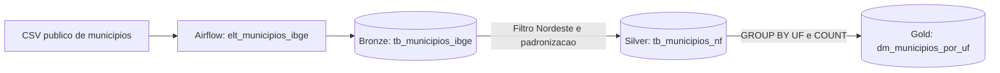

# Governanca de Dados no ELT Lab

Este laboratorio usa o OpenMetadata 2.0.2 para demonstrar catalogacao, ownership,
glossario, classificacao, lineage e qualidade sobre o pipeline real de municipios.
O bootstrap pode ser executado novamente sem duplicar as entidades gerenciadas.

## Papeis

| Equipe | Responsabilidade | Ativos principais |
|--------|------------------|-------------------|
| Data Owners | Aprovar regras e uso dos produtos de dados | Camada Gold |
| Data Stewards | Manter glossario, descricoes e classificacoes | Glossario ELT |
| Data Engineers | Operar fontes, transformacoes e qualidade | Bronze, Silver, Airflow e controle |

As equipes representam papeis demonstrativos. Em producao, devem ser associadas a
usuarios e grupos corporativos reais.

## Classificacao

A classificacao `DataSensitivity` possui os seguintes niveis:

| Tag | Uso |
|-----|-----|
| Public | Dados de fonte publica, como o cadastro de municipios |
| Internal | Metadados destinados ao funcionamento interno do ELT |
| Sensitive | Configuracoes tecnicas que exigem controle adicional |
| Confidential | Historicos tecnicos que podem conter detalhes de erros |
| PII | Dados pessoais identificaveis |

`PII` existe para demonstrar a taxonomia, mas nao e aplicada ao dataset de
municipios porque ele nao contem dados pessoais. Classificacoes devem refletir o
conteudo real, e nao ser usadas apenas para preencher o catalogo.

## Glossario

O glossario `ELTGlossary` define:

| Termo | Significado |
|-------|-------------|
| Municipio | Unidade politico-administrativa local do Brasil |
| UnidadeFederativa | Estado ou Distrito Federal identificado pela sigla UF |
| QuantidadeMunicipios | Contagem de municipios agrupada por UF |
| CamadaBronze | Dados brutos preservados como recebidos |
| CamadaSilver | Dados limpos, padronizados e filtrados |
| CamadaGold | Dados agregados e prontos para consumo analitico |

Os termos sao aplicados como tags aos ativos correspondentes, permitindo busca e
navegacao pelo conceito de negocio.

## Dicionario de Dados

O bootstrap documenta as tabelas e todas as colunas do fluxo principal:

| Camada | Tabela | Owner | Sensibilidade |
|--------|--------|-------|----------------|
| Bronze | `elt_bronze.bronze.global.tb_municipios_ibge` | Data Engineers | Public |
| Silver | `elt_silver.silver.global.tb_municipios_nf` | Data Engineers | Public |
| Gold | `elt_gold.gold.global.dm_municipios_por_uf` | Data Owners | Public |
| Controle | `elt_control.elt.global.schedule` | Data Engineers | Internal, Sensitive |
| Controle | `elt_control.elt.global.controle_execucao` | Data Engineers | Internal, Confidential |

## Lineage

O OpenMetadata recebe lineage em nivel de tabela e coluna entre Bronze, Silver e
Gold. As arestas registram as consultas SQL e fazem referencia ao pipeline do
Airflow. O CSV externo permanece descrito como origem da tabela Bronze, pois nao e
uma entidade tabular interna do catalogo.

## Qualidade

O bootstrap cria e publica o resultado de tres testes de volume:

| Teste | Regra esperada |
|-------|----------------|
| `bronze_municipios_row_count` | Entre 5500 e 6000 linhas |
| `silver_nordeste_row_count` | Entre 1700 e 1900 linhas |
| `gold_ufs_row_count` | Exatamente 9 linhas |

Os resultados sao calculados no PostgreSQL e publicados no historico de Data
Quality do OpenMetadata. Uma violacao encerra o bootstrap com erro, tornando a
checagem adequada para automacao local ou CI.

O CSV demonstrativo e fixado no commit
`975a51d6f2e7a9ee22a734a42ebd624263812f0c` da fonte publica para manter schema e
contagens reproduziveis.

## Seguranca e Operacao

- O OpenMetadata e publicado apenas em `127.0.0.1`, na porta definida por `OPENMETADATA_PORT` (`8585` por padrao).
- As credenciais sao geradas a partir do unico `.env`, ignorado pelo Git; os servicos persistem os dados de autenticacao necessarios em seus bancos internos.
- Todos os servicos pertencem ao projeto Docker `elt`; PostgreSQL e Elasticsearch do OpenMetadata mantem volumes proprios.
- A senha administrativa default e rotacionada automaticamente para o valor aleatorio de `OM_ADMIN_PASSWORD`.
- Senhas nao devem ser colocadas em documentacao, argumentos de commit ou logs.
- O login administrativo usa senha aleatoria mesmo no laboratorio local.
- A conta bootstrap desta versao e fixa em `admin@open-metadata.org`; somente sua senha e configuravel.
- Uma chave Fernet antiga, ja rotacionada e sem uso atual, permanece no historico Git como risco historico aceito. Ela nao deve ser reutilizada.
- Em producao, usar SSO, TLS, secret manager, contas de ingestao com menor privilegio, backups e politicas de retencao.

O conector PostgreSQL pode avisar que `pg_stat_statements` nao esta instalado. Isso
afeta apenas a coleta de consultas e usage; catalogo, dicionario, lineage e testes
continuam funcionais.
